  

  
  
  
  

## About me

I'm a software developer based in Istanbul, working across mobile (Flutter, Swift) and backend (.NET, Laravel).

What I care about most is how code is structured: clear layers, small testable pieces, and boundaries that make change cheap. I'm currently open to mobile, backend and full-stack roles.

## Architectures I like

  

## Tech stack

  

## GitHub stats

  
  

  

  

  

  <picture>
    <source media="(prefers-color-scheme: dark)" srcset="https://raw.githubusercontent.com/emrekemanc/emrekemanc/output/github-snake-dark.svg"/>
    <source media="(prefers-color-scheme: light)" srcset="https://raw.githubusercontent.com/emrekemanc/emrekemanc/output/github-snake.svg"/>
    
  </picture>

